# MuseIQ - Guia inteligente contextual para museos

MuseIQ es una propuesta de tesis y prototipo funcional para convertir la visita a museos en una experiencia contextual, accesible y conversacional. La solucion combina balizas BLE de bajo costo, sensores del smartphone, contenido curatorial estructurado, voz y una capa de inteligencia artificial con RAG para responder preguntas del visitante segun la sala, obra o recorrido detectado.

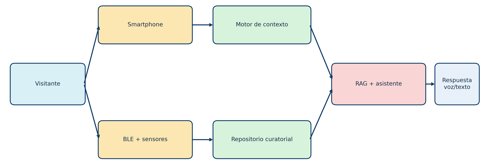

## Resumen ejecutivo

La tesis plantea una guia inteligente para museos peruanos, orientada a instituciones que necesitan modernizar su mediacion cultural sin depender de infraestructura costosa, audioguias dedicadas o renovaciones museograficas completas. El visitante usa su propio telefono, mientras el museo instala nodos BLE/ESP32, organiza su informacion curatorial y opera una plataforma capaz de activar contenido y responder consultas contextualizadas.

El enfoque principal no es localizar al visitante con precision centimetral, sino reconocer de manera robusta la sala, zona o nodo cultural probable. Sobre esa base, MuseIQ entrega contenido, audio, accesibilidad y conversacion asistida por IA.

La tesis esta desarrollada en 12 capitulos e incluye el analisis de mercado, el diseno tecnico, el prototipo, el modelo comercial por paquetes y una evaluacion economica-financiera a 10 anos.

## Problema que aborda

Los museos suelen depender de cartelas, paneles, recorridos guiados o recursos digitales aislados. Esto limita la personalizacion, la accesibilidad, la continuidad del relato y la posibilidad de resolver preguntas especificas del visitante durante el recorrido.

MuseIQ responde a cuatro brechas principales:

- Falta de mediacion contextual en tiempo real.
- Baja personalizacion del contenido cultural.
- Barreras de accesibilidad para visitantes que requieren audio, texto alternativo o interaccion por voz.
- Dificultad de implementar tecnologias avanzadas en museos con presupuestos limitados.

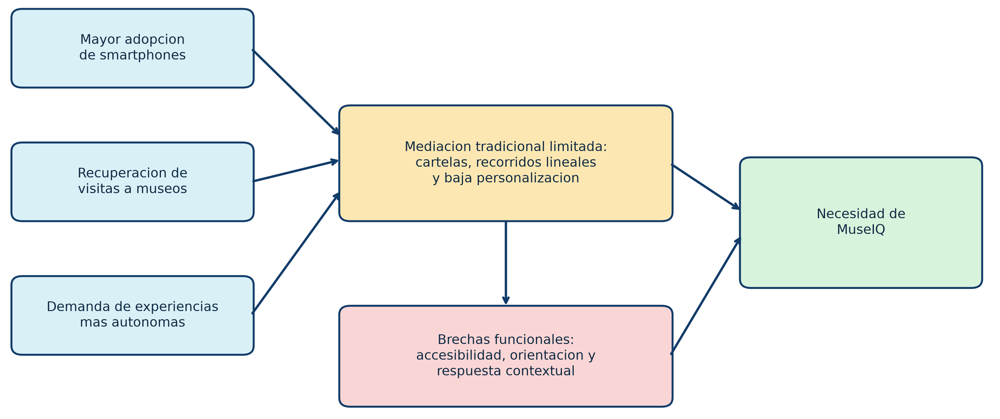

## Solucion propuesta

MuseIQ se organiza como una solucion modular que puede implementarse por etapas. La experiencia se apoya en cinco bloques tecnicos:

- **Infraestructura de proximidad:** nodos BLE basados en ESP32 o ESP32-C3 para identificar salas, vitrinas o zonas de interes.
- **Aplicacion movil BYOD:** el visitante usa su propio smartphone para recibir contenido, escuchar audio, escanear QR y formular preguntas.
- **Motor contextual:** combina RSSI, orientacion del dispositivo, sala probable y reglas de activacion para seleccionar el contenido adecuado.
- **Capa de inteligencia artificial:** backend RAG con corpus curatorial institucional para responder preguntas con base documental.
- **Operacion institucional:** paneles, mantenimiento, capacitacion, analitica y actualizacion de contenidos segun el paquete contratado.

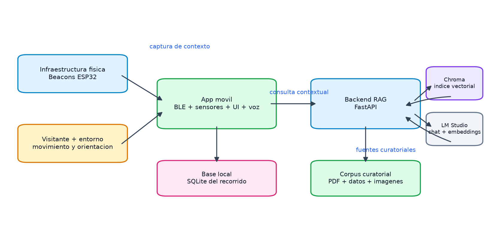

## Diseno del paquete de servicio

La tesis no plantea MuseIQ como un producto generico, sino como una solucion institucional empaquetada. Cada paquete incluye diagnostico, despliegue, configuracion, contenidos, soporte y mantenimiento.

| Paquete | Cobertura referencial | Perfil de museo | Alcance principal |
| --- | ---: | --- | --- |
| Basico | 3 a 5 salas o nodos | Museo pequeno, sala municipal, casa museo o sitio cultural acotado | BLE/QR, app visitante, contenidos guiados, audio basico y soporte inicial |
| Estandar | 6 a 10 salas o nodos | Museo regional, arqueologico o tematico con recorrido definido | Mayor cobertura, analitica, asistencia por voz, RAG institucional y mantenimiento anual |
| Avanzado | 12 a 18 salas o nodos | Museo de alta afluencia o institucion con varias rutas | Despliegue extendido, corpus ampliado, soporte reforzado, analitica y servicios complementarios |

En el modelo financiero, los precios base del Capitulo 5 se ajustan para reflejar formalizacion, garantia, gestion contractual y contingencia operativa. La evaluacion economica del Capitulo 10 usa estos valores de flujo:

| Paquete | Implementacion para flujo | Recurrencia anual para flujo |
| --- | ---: | ---: |
| Basico | S/ 57,600 | S/ 16,800 |
| Estandar | S/ 115,200 | S/ 34,800 |
| Avanzado | S/ 222,000 | S/ 62,400 |

## Mercado objetivo

El mercado inicial se enfoca en museos peruanos con afluencia, valor patrimonial y necesidad de mejorar la experiencia del visitante. La tesis prioriza instituciones del Ministerio de Cultura, museos regionales y museos de sitio, con especial atencion al corredor Lambayeque-Sipan por su flujo turistico y relevancia arqueologica.

La estrategia comercial no busca una adopcion masiva inmediata. Se plantea una captacion progresiva de instituciones con nombre propio en el Capitulo 5, hasta llegar a 35 museos activos en 10 anos en el escenario base.

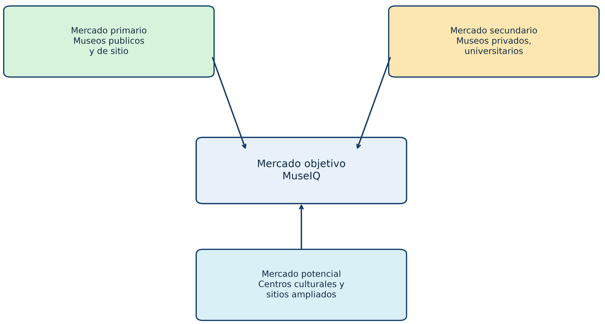

## Flujo comercial proyectado

El flujo de ingresos parte de la venta de implementacion inicial y continua con ingresos recurrentes por mantenimiento, IA, analitica, soporte y servicios adicionales. La proyeccion a 10 anos detalla la entrada progresiva de museos por paquete, evitando tratar el mercado como una cantidad anonima de clientes.

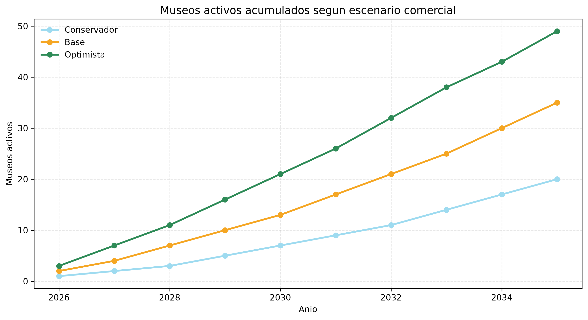

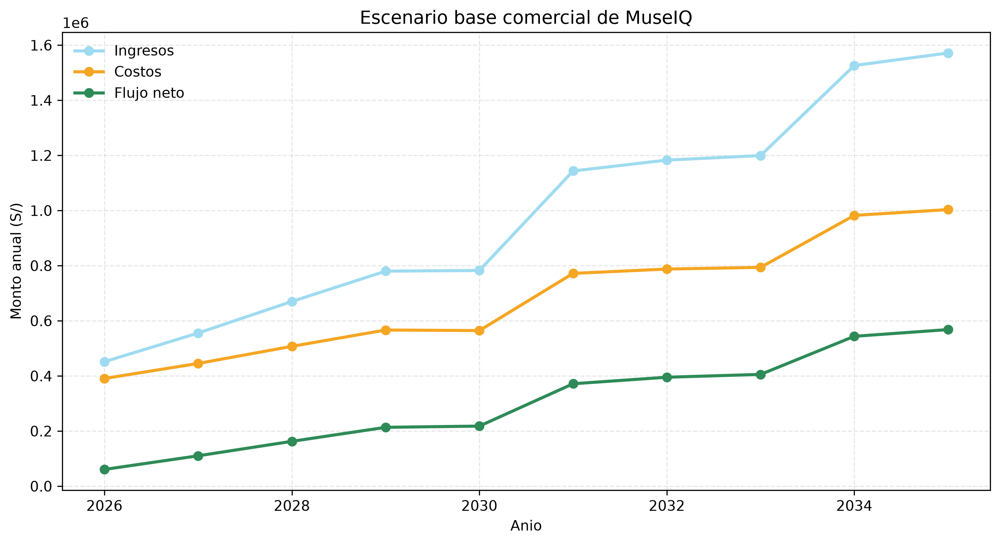

## Evaluacion economica y financiera

El Capitulo 10 adapta la estructura del flujo de caja de proyecto de titulo de la FIEE-UNI al caso MuseIQ. La evaluacion usa un horizonte de 10 anos, soles nominales, financiamiento mixto e impuesto a la renta.

Indicadores principales del escenario base:

| Indicador | Resultado |
| --- | ---: |
| Inversion inicial total | S/ 300,000 |
| Aporte propio | S/ 120,000 |
| Deuda | S/ 180,000 |
| Tasa de corte | 18.46% |
| VAN | S/ 444,585 |
| TIR | 33.99% |
| Indice de rentabilidad | 2.48 |
| Payback descontado | 6.35 anos |

La tesis concluye que el proyecto es viable bajo el escenario base, aunque sensible a reducciones fuertes de ingresos, descuentos agresivos y problemas de cobranza.

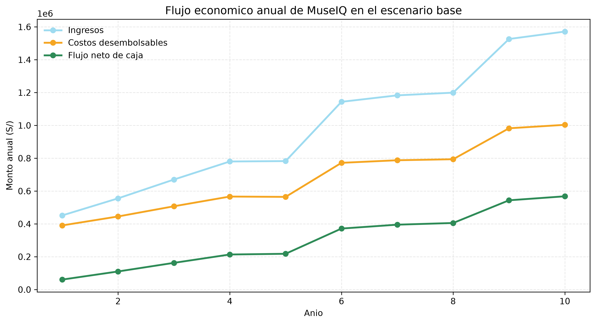

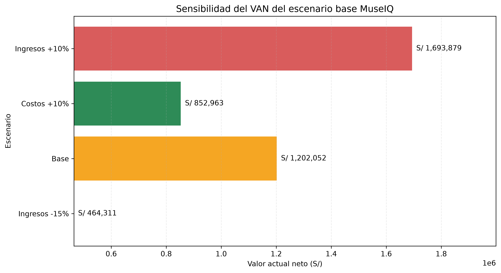

## Prototipo tecnico

El prototipo valida la factibilidad tecnica de MuseIQ con componentes reales y simulados:

- Nodos BLE ESP32/ESP32-C3 con identificadores de sala y emision periodica.
- Aplicacion movil desarrollada con Expo/React Native.
- Lectura de RSSI, suavizado de senal y seleccion de sala probable.
- Uso de orientacion del smartphone para complementar el contexto.
- Escaneo QR como mecanismo auxiliar de activacion.
- Persistencia local con SQLite.
- Backend FastAPI con endpoint `/api/preguntar`.
- Base vectorial Chroma para recuperacion de contenido curatorial.
- Integracion local con LM Studio para respuestas generadas.
- Simulador web para representar recorridos, salas y eventos.

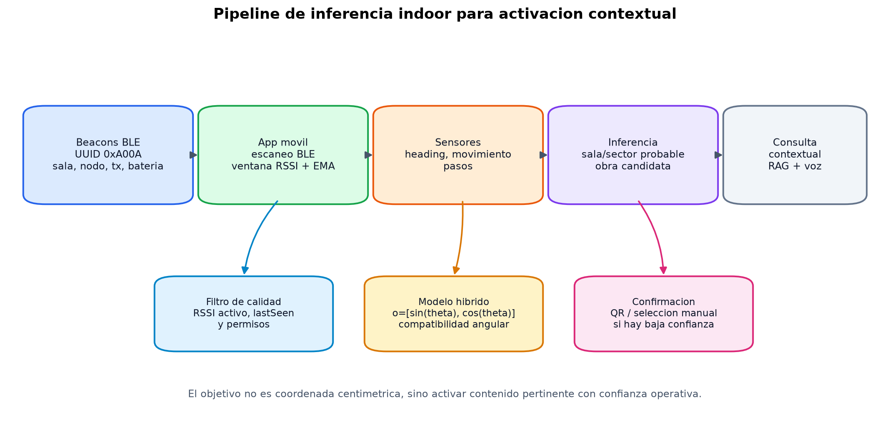

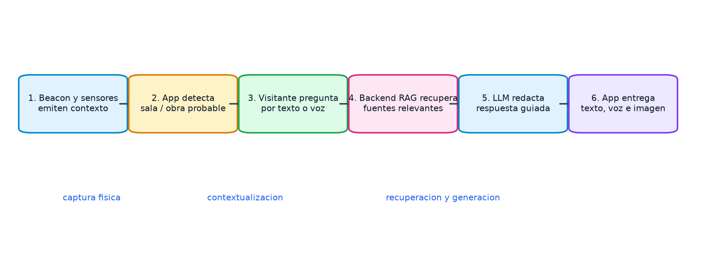

## Datos y arquitectura de informacion

La informacion curatorial se organiza como un conjunto de datos de entrada que vincula salas, objetos, nodos, beacons, contenido textual, audio, metadatos y consultas. La tesis plantea compatibilidad conceptual con estandares culturales y de datos como CIDOC CRM, LIDO, Dublin Core, JSON/RFC 8259 e ISO/IEC 25012.

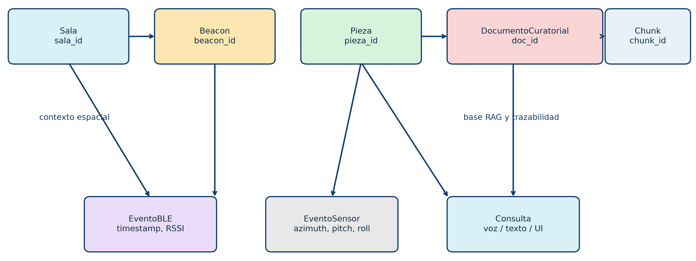

## Estructura del repositorio

| Ruta | Contenido |
| --- | --- |
| `tesis/tesis/tesis.tex` | Documento principal de la tesis en LaTeX |
| `tesis/tesis/src/chapters/` | Capitulos 1 al 12 y anexos |
| `tesis/graficos/` | Scripts y salidas graficas usadas por la tesis |
| `tesis/graficos/output/` | Graficos PNG organizados por capitulo |
| `tesis/presentaciones/` | Presentacion LaTeX del proyecto |
| `tesis/simulacion/` | Simulador web de la experiencia MuseIQ |
| `tesis/tesis/investigaciones/` | Investigaciones de soporte por capitulo |
| `documentacion-cap-economico/` | Plantilla y archivos de referencia para el flujo economico |
| `tesis-plantilla/` | Plantilla LaTeX institucional de referencia |

## Compilacion de la tesis

Desde la carpeta del documento:

```powershell
cd tesis/tesis
latexmk -pdf -interaction=nonstopmode tesis.tex
```

Si no se cuenta con `latexmk`, tambien puede compilarse con una secuencia tradicional de `pdflatex`, `bibtex` y nuevas pasadas de `pdflatex`, segun la instalacion local de LaTeX.

## Generacion de graficos

Los graficos se encuentran versionados como PNG en `tesis/graficos/output/`. Para regenerarlos:

```powershell
cd tesis/graficos
python ejemplos_uso.py all
```

Los capitulos con graficos generados incluyen problema y contexto, mercado objetivo, oferta tecnologica, flujo de ingresos, fundamentos tecnicos, datos de entrada, diseno de despliegue y evaluacion economica.

## Simulacion web

El repositorio incluye una simulacion web de MuseIQ que permite representar salas, interacciones y flujos de visita.

```powershell
cd tesis/simulacion
python -m http.server 8000
```

Luego abrir:

```text
http://localhost:8000
```

Tambien existe una publicacion web de referencia:

```text
http://eduardoguev.me/Tesis/
```

## Estado actual de la tesis

El documento integra los 12 capitulos principales, anexos, graficos, diseno de solucion, validacion tecnica, mercado objetivo, flujo comercial detallado y evaluacion economica-financiera. La propuesta se presenta como prototipo academico con viabilidad tecnica y comercial, no como producto final listo para produccion.

Limitaciones declaradas:

- El backend RAG funciona como prototipo local.
- El corpus curatorial debe ampliarse y validarse con cada museo.
- La aplicacion movil requiere endurecimiento para despliegue productivo.
- La localizacion se orienta a sala o nodo probable, no a precision centimetral.
- La viabilidad financiera depende de mantener precios, cobranza y adopcion institucional dentro de los supuestos del escenario base.

## Documentos principales

- [Tesis principal](tesis/tesis/tesis.tex)
- [Capitulo 5 - Flujo de ingresos](tesis/tesis/src/chapters/ch05-flujo-ingresos.tex)
- [Capitulo 9 - Diseno y despliegue](tesis/tesis/src/chapters/ch09-diseno-despliegue.tex)
- [Capitulo 10 - Evaluacion economica](tesis/tesis/src/chapters/ch10-evaluacion-economica.tex)
- [Investigacion Capitulo 5](tesis/tesis/investigaciones/cap%2005/investigacion-cap-05.md)
- [Nueva investigacion Capitulo 5](tesis/tesis/investigaciones/cap%2005/nueva-inv-cap-05)

